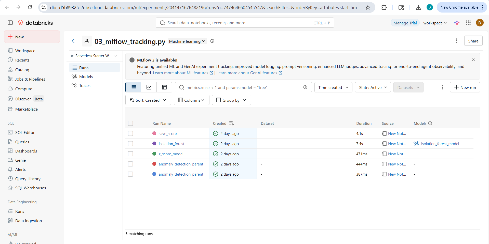
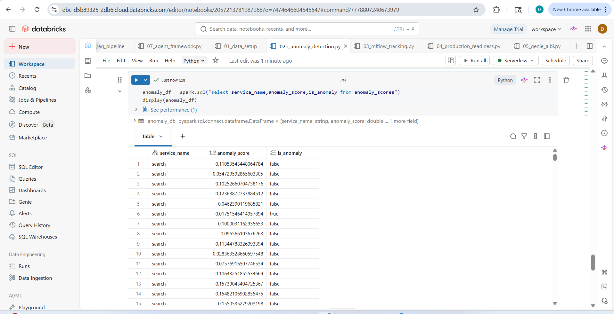
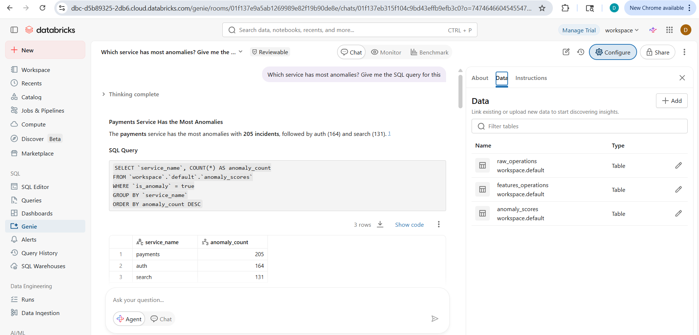
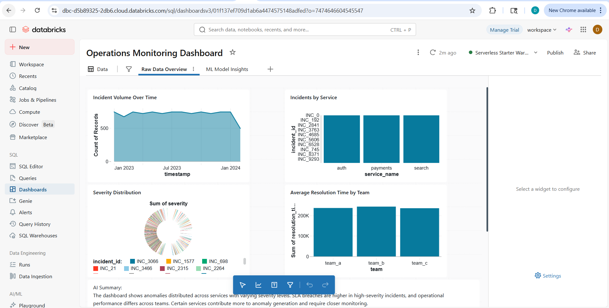
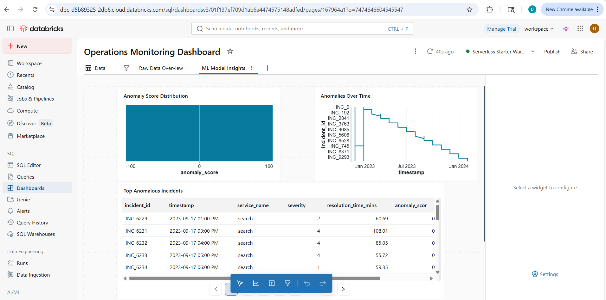
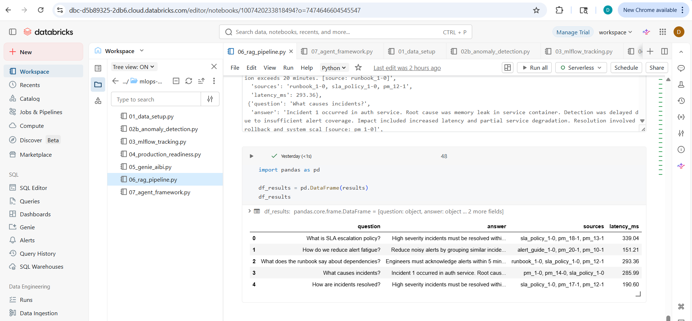
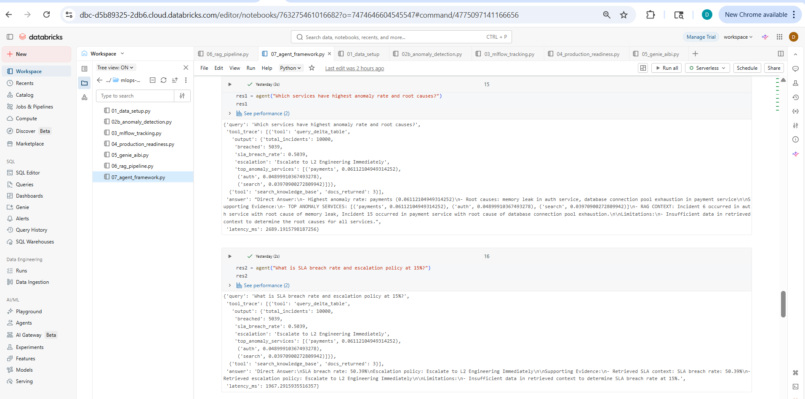

# 🚀 MLOps + GenAI Agent System

## 🧠 Domain Path
Operations Monitoring / AI-driven Incident Intelligence

---

## 📌 Project Overview
This project builds an end-to-end AI system that bridges structured ML pipelines with unstructured knowledge systems for intelligent decision support.

It includes:

- Processes operational incident data
- Engineers time-series and SLA-based features
- Trains anomaly detection models
- Tracks experiments using MLflow
- Deploys production-ready scoring pipelines
- Builds a RAG pipeline for incident knowledge retrieval
- Implements a tool-using LLM agent for multi-step reasoning
- Enables business intelligence via Genie and AI BI dashboards

---

## 🏗️ Architecture

Data → Delta Lake → Feature Engineering → ML Model → MLflow  
→ Production Pipeline → RAG System → LLM Agent → BI Dashboard

---

## ⚙️ Modules

### 01 - Data Setup
Simulate and store operational incident data in Delta tables

### 02 - Anomaly Detection
Train and evaluate anomaly detection models (Z-score vs Isolation Forest)

### 03 - MLflow Tracking
Track experiments, log metrics, and compare model performance

### 04 - Production Readiness
Define serving configuration, monitoring strategy, and batch scoring pipeline

### 05 - Genie + AI BI Dashboard
Enable self-service analytics with natural language queries and dashboards

### 06 - RAG Pipeline
Build document retrieval system using incident postmortems and policies

### 07 - Agent Framework
Develop a multi-tool LLM agent for reasoning across structured + unstructured data

---

## 🤖 Agent Capabilities

- Query Delta tables for operational metrics
- Run ML-based anomaly predictions
- Retrieve knowledge from RAG system
- Fetch model performance metrics
- Perform multi-step reasoning using LLM

---

## 📊 Tech Stack

- Databricks
- Apache Spark
- Delta Lake
- MLflow
- Mosaic AI Vector Search (conceptual / fallback implemented)
- Groq LLM (Llama 3.1)
- Python

---

## ▶️ How to Run

Execute notebooks in order:

1. /01_data_setup
2. /02_ml_model
3. /03_mlflow
4. /04_production
5. /05_genie_aibi
6. /06_rag_pipeline
7. /07_agent_framework

---

## 🎯 Key Outcome

The system enables:

- Early detection of anomalous incidents  
- Reduced SLA breaches through proactive monitoring  
- Faster root cause analysis using RAG-based knowledge retrieval  
- Intelligent decision support via AI agent orchestration  

---

## 📸 Results

### 📸 Experiment Tracking (MLflow)

This screenshot shows MLflow experiment tracking within Databricks.

- Multiple anomaly detection runs are logged (Z-score, Isolation Forest)
- Metrics such as precision, recall, and F1-score are tracked
- Run filtering enables comparison across experiments
- Supports reproducibility, governance, and experiment management

---

### 📊 Model Output (Anomaly Detection)

This table represents the model output:

- **service_name**: Service where the incident occurred  
- **anomaly_score**: Model-generated anomaly score  
- **is_anomaly**: Binary indicator of anomaly  

This confirms that the model successfully generated actionable anomaly predictions.

---

### 🤖 Genie Space (AI BI)

This screenshot demonstrates Genie-powered analytics:

- Tables available: `raw_operations`, `features_operations`, `anomaly_scores`  
- Example query: *“Which service has most anomalies?”*  
- Result highlights high-risk services (e.g., payments, auth, search)

This enables natural language querying for non-technical users.

---

### 📈 AI BI Dashboard

#### Tab 1 – Raw Data Overview

- Incident trends over time  
- SLA breach rates by service  
- Severity distribution  
- Resolution time by team  

This provides baseline operational visibility.

---

#### Tab 2 – ML Insights

- Anomaly score distribution  
- Timeline of anomaly events  
- Top anomalous incidents  

This demonstrates how ML outputs are translated into business insights.

---

### 🔎 RAG Pipeline Output

This screenshot shows results from the RAG pipeline:

- **question**: User query  
- **answer**: Context-aware generated response  
- **sources**: Supporting document references  
- **latency**: Response time (ms)  

This confirms that the system generates grounded answers with traceable sources.

---

### 🤖 Agent Output (Tool-Use AI Agent)

This demonstrates the multi-tool AI agent:

- Executes queries on Delta tables  
- Retrieves knowledge from RAG pipeline  
- Combines structured + unstructured data  
- Produces final synthesized answers with reasoning  

This showcases multi-step reasoning and real-world AI system orchestration.

---

## ⚠️ Notes

- API keys and tokens are removed for security
- Some components (model registry, vector search) are partially implemented due to environment constraints
- System is designed to reflect production architecture even where full deployment is not executed
